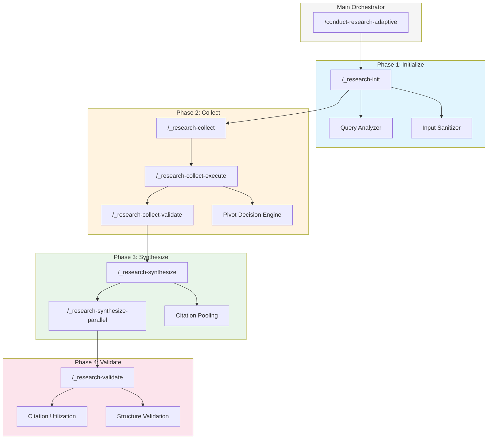
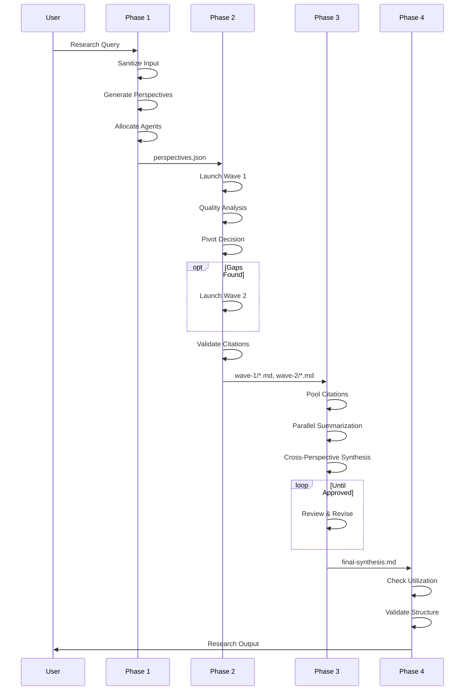

# Architecture Overview

The adaptive research workflow orchestrates multiple AI agents through four phases, each with specific responsibilities and quality gates.

## System Design



## Component Inventory

### Slash Commands

| Command | Lines | Purpose |
|---------|-------|---------|
| `/conduct-research-adaptive` | ~500 | Main orchestrator |
| `/_research-init` | ~450 | Query analysis, session setup |
| `/_research-collect` | ~130 | Collection orchestrator |
| `/_research-collect-execute` | ~1,270 | Agent launch, pivot decision |
| `/_research-collect-validate` | ~370 | Citation extraction, URL validation |
| `/_research-synthesize` | ~600 | Synthesis orchestration |
| `/_research-synthesize-parallel` | ~400 | Parallel summarization |
| `/_research-validate` | ~230 | Final quality gates |

### TypeScript Utilities

| Utility | Location | Purpose |
|---------|----------|---------|
| Query Analyzer | `~/.claude/utilities/query-analyzer/` | Perspective generation, agent allocation |
| Quality Analyzer | `~/.claude/utilities/quality-analyzer/` | Pivot decisions, coverage analysis |
| Input Sanitizer | `~/.claude/utilities/input-sanitizer/` | Prompt injection prevention |

### Agents

| Agent | Model | Role |
|-------|-------|------|
| `perplexity-researcher` | Sonnet | Web search specialist |
| `claude-researcher` | Sonnet | Analytical research |
| `gemini-researcher` | Sonnet | Multi-source research |
| `grok-researcher` | Sonnet | Real-time data |
| `perspective-summarizer` | Sonnet | Condense perspective files |
| `cross-perspective-synthesizer` | Opus | Final synthesis |
| `research-reviewer` | Sonnet | Quality review |
| `synthesis-writer` | Opus | Synthesis production |

## Data Flow

### Session Directory Structure

Each research session creates this directory tree:

```
~/.claude/scratchpad/research/YYYYMMDD-HHMMSS-XXXX/
├── analysis/
│   ├── query-analysis.json      # Perspective allocation
│   ├── perspectives.json        # Generated perspectives
│   ├── quality-analysis.json    # Coverage metrics
│   ├── pivot-decision.json      # Wave 2 decision
│   └── unified-citations.md     # Validated citation pool
├── wave-1/
│   ├── perplexity-*.md          # Wave 1 agent outputs
│   ├── claude-*.md
│   └── ...
├── wave-2/
│   ├── specialist-*.md          # Wave 2 agent outputs (if any)
│   └── ...
├── summaries/
│   ├── summary-perplexity.md    # Condensed perspectives
│   ├── summary-claude.md
│   └── ...
└── synthesis/
    └── final-synthesis.md       # Final output
```

### Information Flow



## Design Principles

### 1. Context Efficiency

Each phase runs in isolation with only the context it needs. The orchestrator passes minimal data between phases, keeping agent context fresh.

**Old approach:** Single 116KB command loaded everything upfront.

**Current approach:** Orchestrator (3KB) calls phase commands (10-20KB each) as needed.

### 2. Perspective-First Routing

The query analyzer generates research perspectives before deciding which agents to use. This ensures agents receive focused, well-defined research tasks rather than vague queries.

### 3. Quality-Driven Decisions

Wave 2 launches only when quality signals indicate gaps:
- Coverage below 70%
- Missing domain expertise
- Source diversity issues
- Contrarian views absent

### 4. Citation Integrity

Citations flow through validation at every step:
- Extraction from agent outputs
- URL validation (HTTP checks)
- Deduplication across agents
- Unified ID assignment
- Inline reference tracking

### 5. Grounded Synthesis

Synthesis agents cannot access the internet. They work only with pre-gathered, validated research. This prevents hallucination and ensures all claims trace to sources.

## Quality Matrix

The pivot decision engine evaluates five components:

| Component | Weight | Measures |
|-----------|--------|----------|
| Coverage | 25% | Are all perspectives addressed? |
| Depth | 20% | Is each perspective thoroughly explored? |
| Source Quality | 20% | Do sources meet tier requirements? |
| Diversity | 20% | Are tracks properly represented? |
| Confidence | 15% | How certain are the findings? |

## Version History

| Version | Date | Changes |
|---------|------|---------|
| M13.2 | 2025-12-26 | Parallel synthesis, producer/approver loop |
| M13.1 | 2025-12-25 | Command splitting, context reduction |
| M13.0 | 2025-12-24 | Initial adaptive two-wave architecture |

---

Next: [Phase 1: Initialize](./phases/01-initialize.md)
