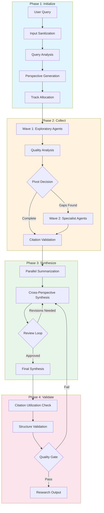
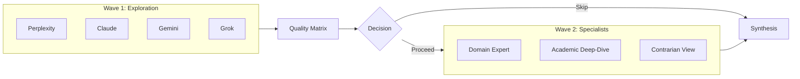
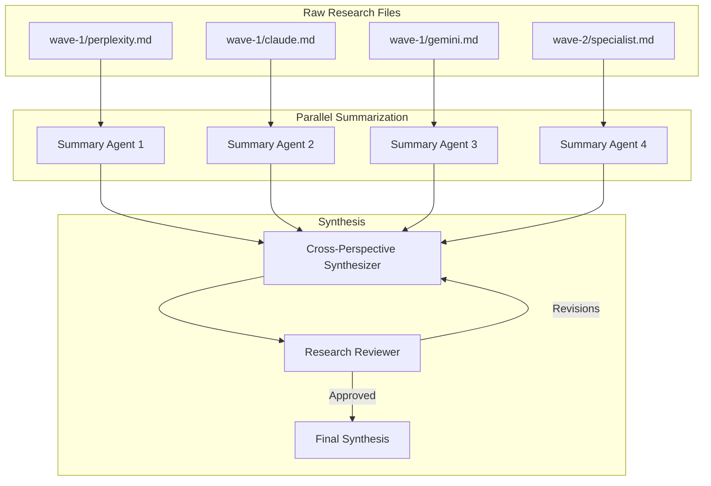
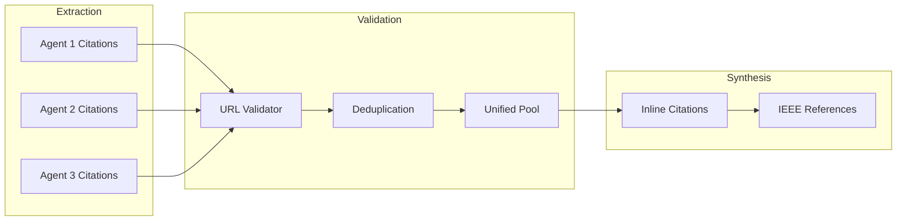

# Adaptive Research Workflow

A multi-agent research orchestration system that intelligently gathers, validates, and synthesizes information from diverse sources.

## How It Works



## Quick Start

Run a research query:
```bash
/conduct-research-adaptive "Your research question here"
```

The system handles everything else: agent selection, quality control, citation validation, and synthesis.

## Core Concepts

### Adaptive Two-Wave Research

Wave 1 launches 4-6 exploratory agents. A quality analyzer then decides whether Wave 2 specialists are needed based on coverage gaps, domain signals, and source quality.



### Track Allocation (Source Diversity)

Research tracks ensure diverse source coverage:

| Track | Allocation | Purpose |
|-------|------------|---------|
| Standard | 50% | Mainstream consensus, balanced sources |
| Independent | 25% | Academic sources, non-vendor perspectives |
| Contrarian | 25% | Opposing viewpoints, critical analysis |

### Quality Gates

Every phase enforces quality through:
- **Input sanitization** - Blocks prompt injection attempts
- **Citation validation** - Verifies URLs, tracks hallucination rate
- **Structure validation** - Ensures academic format compliance
- **Utilization checks** - Requires 60%+ citation coverage

## Documentation

| Document | Description |
|----------|-------------|
| [Architecture Overview](./ARCHITECTURE.md) | System design, component relationships |
| [Security](./security/README.md) | Prompt injection prevention, input sanitization |
| **Phase Guides** | |
| [Phase 1: Initialize](./phases/01-initialize.md) | Query analysis, perspective generation |
| [Phase 2: Collect](./phases/02-collect.md) | Agent orchestration, pivot decisions |
| [Phase 3: Synthesize](./phases/03-synthesize.md) | Parallel synthesis, review loop |
| [Phase 4: Validate](./phases/04-validate.md) | Quality gates, final checks |
| **Reference** | |
| [Agents](./agents/README.md) | Agent types and capabilities |
| [Commands](./reference/commands.md) | All slash commands |
| [File Structure](./reference/file-structure.md) | Session directory layout |
| [Troubleshooting](./reference/troubleshooting.md) | Common issues and solutions |

## Key Features

### Parallel Synthesis Architecture



### Citation Flow



## Version

**M13.2** - Parallel Synthesis with Producer/Approver Loop (2025-12-26)

---

[View full technical documentation](./ARCHITECTURE.md)
