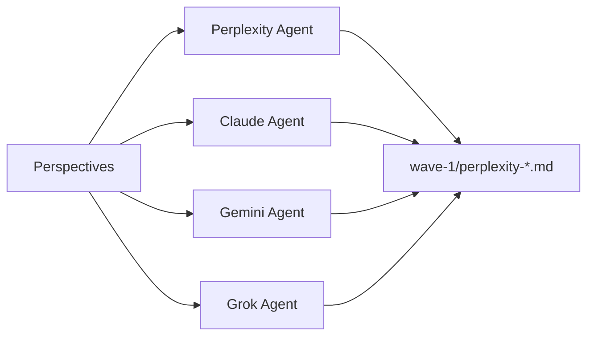
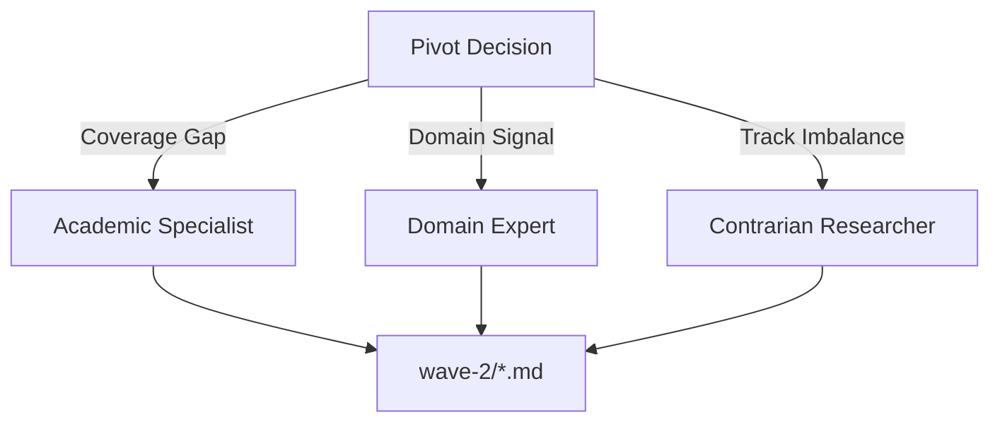

# Phase 2: Collect

Phase 2 executes research agents in two waves, analyzes quality, and validates citations.

## Commands

```bash
/_research-collect           # Orchestrator
/_research-collect-execute   # Agent launch + pivot
/_research-collect-validate  # Citation validation
```

## Wave 1: Exploratory Research

### Agent Launch

Wave 1 launches 4-6 agents in parallel, each assigned perspectives from Phase 1:



Each agent receives:
- Assigned perspective(s)
- Track designation (standard/independent/contrarian)
- Output format requirements
- Citation requirements

### Agent Output Format

Agents produce structured markdown:

```markdown
# Research: [Perspective Title]

## Key Findings
- Finding 1 with citation [Source](URL)
- Finding 2 with citation [Source](URL)

## Detailed Analysis
[Paragraphs with inline citations...]

## Sources
1. [Title](URL) - Description
2. [Title](URL) - Description

## Metadata
- Agent: perplexity-researcher
- Track: standard
- Confidence: 85%
- Sources: 12
```

### Quality Analysis

After Wave 1 completes, the quality analyzer evaluates results:

```bash
bun ~/.claude/utilities/quality-analyzer/quality-analyzer.ts \
  --session "$SESSION_DIR" \
  --phase wave-1
```

The analyzer produces a 5-component quality matrix:

| Component | Weight | Measures |
|-----------|--------|----------|
| Coverage | 25% | Percentage of perspectives addressed |
| Depth | 20% | Detail level per perspective |
| Source Quality | 20% | Source tier distribution |
| Diversity | 20% | Track representation balance |
| Confidence | 15% | Agent-reported confidence |

## Pivot Decision

The pivot decision engine determines whether Wave 2 is needed:

```typescript
interface PivotDecision {
  shouldPivot: boolean;
  reason: string;
  specialists: SpecialistRecommendation[];
  triggers: PivotTrigger[];
}
```

### Pivot Triggers

Wave 2 launches when any trigger activates:

| Trigger | Condition | Priority |
|---------|-----------|----------|
| Coverage Gap | Perspective addressed <70% | HIGH |
| Domain Signal | Specialized domain detected | HIGH |
| Source Quality | Tier 1 sources <20% | MEDIUM |
| Track Imbalance | Contrarian views missing | MEDIUM |
| Confidence Low | Average confidence <60% | LOW |

### Pivot Skip Conditions

Wave 2 skips when all conditions met:
- Coverage >85%
- All perspectives addressed
- Track balance acceptable
- No domain signals

## Wave 2: Specialist Research

When pivoting, Wave 2 launches targeted specialists:



Specialists receive:
- Specific gap to address
- Wave 1 context summary
- Higher source tier requirements
- Focused scope

## Citation Validation

After all agents complete, citations undergo validation:

```bash
/_research-collect-validate
```

### Extraction

Citations are extracted from all wave files:
- Markdown link format: `[Title](URL)`
- Reference format: `1. [Title](URL)`
- Inline mentions with URLs

### URL Validation

Each URL is checked:
- HTTP HEAD request for accessibility
- Status code verification
- Redirect tracking
- Domain reputation check

### Deduplication

Citations are deduplicated across agents:
- URL normalization (trailing slashes, protocols)
- Title similarity matching
- Source consolidation

### Unified Pool

Valid citations receive unified IDs:

```markdown
# Unified Citation Pool

[1] Smith, "AI Frameworks 2025," TechBlog, 2025-01-15. Available: https://...
[2] Johnson, "Multi-Agent Systems," ArXiv, 2024-12-01. Available: https://...
...
```

## Outputs

| File | Content |
|------|---------|
| `wave-1/*.md` | Wave 1 agent outputs |
| `wave-2/*.md` | Wave 2 specialist outputs (if any) |
| `analysis/quality-analysis.json` | Quality matrix results |
| `analysis/pivot-decision.json` | Wave 2 decision details |
| `analysis/unified-citations.md` | Validated citation pool |

## Quality Gates

Phase 2 fails if:
- No Wave 1 agents complete successfully
- All agents produce empty outputs
- Citation validation finds zero valid URLs
- Hallucination rate exceeds 30%

---

Next: [Phase 3: Synthesize](./03-synthesize.md)
