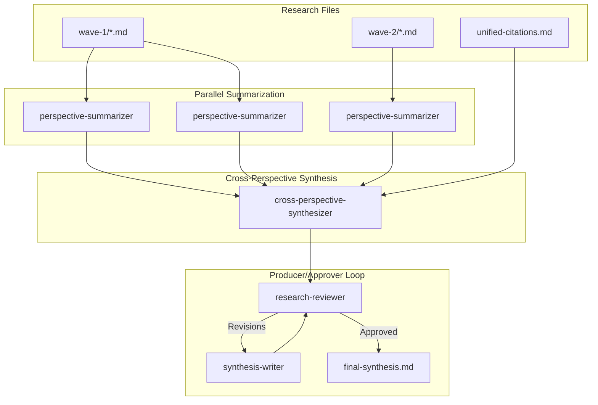

# Phase 3: Synthesize

Phase 3 produces the final research synthesis through parallel summarization, cross-perspective analysis, and quality review.

## Commands

```bash
/_research-synthesize           # Main orchestrator
/_research-synthesize-parallel  # Parallel summarization
```

## Architecture



## Parallel Summarization

### Why Parallel?

Raw research files total 200-450KB. A single synthesis agent would overflow context. Instead, each perspective file gets its own summarizer agent running in parallel.

### Summarizer Task

Each `perspective-summarizer` agent:
1. Reads one wave file (~25-30KB)
2. Extracts key findings with citations preserved
3. Identifies unique insights
4. Maps local citations to unified pool IDs
5. Produces condensed summary (~3-5KB)

### Output Format

```markdown
# Summary: [Perspective Title]

**Agent:** perplexity-researcher
**Track:** standard
**Original Size:** 28KB
**Summary Size:** 4KB

## Key Findings

1. **Finding** - Explanation [1][4]
2. **Finding** - Explanation [2][7]

## Unique Insights

- Insight not found in other perspectives [5]

## Citation Mapping

| Local | Unified | Title |
|-------|---------|-------|
| [1] | [4] | "Source Title" |
| [2] | [7] | "Another Source" |
```

## Cross-Perspective Synthesis

The `cross-perspective-synthesizer` agent receives:
- All perspective summaries (~40-55KB total)
- Unified citation pool
- Session metadata

### Six-Part Academic Structure

The synthesis follows M11 format:

```markdown
# [Title]

## Part I: Executive Summary
- Abstract answering the core query
- Key findings at-a-glance (5 items)

## Part II: Research Methodology
- Agent attribution table
- Quality metrics

## Part III: Research Findings by Perspective
- One section per perspective
- Detailed findings with inline citations

## Part IV: Integrated Analysis
- Cross-perspective synthesis
- High-confidence findings (multi-source)
- Areas of uncertainty
- Divergent viewpoints

## Part V: Emergent Research Directions
- Research gaps identified
- Recommended follow-up queries

## Part VI: References and Appendices
- IEEE-format references
- Synthesis metadata
```

### Citation Requirements

Every factual claim requires inline citations:

**Correct:**
> FLUX.1 achieved state-of-the-art results [4], with 95% human preference [7]. ComfyUI [12] enables iterative refinement through controlnets [14].

**Wrong:**
> FLUX.1 achieved state-of-the-art results with high human preference. ComfyUI enables iterative refinement through controlnets.

Target: 60%+ citation utilization from the unified pool.

## Producer/Approver Loop

### Review Process

The `research-reviewer` agent validates synthesis quality:

1. **Structure Check** - All six parts present
2. **Citation Density** - Inline citations per paragraph
3. **Utilization Check** - Percentage of pool used
4. **IEEE References** - Part VI completeness
5. **Content Quality** - Track representation, perspectives covered

### Verdicts

**APPROVED:**
```markdown
## Status: APPROVED

| Metric | Value | Status |
|--------|-------|--------|
| Structure | 6/6 | Pass |
| Citations | 47 instances | Pass |
| Utilization | 72% | Pass |
```

**REVISIONS REQUIRED:**
```markdown
## Status: REVISIONS REQUIRED

### Issue 1: Missing Citations
**Location:** Part III, Paragraph 3
**Problem:** No inline citations for statistics
**Fix:** Add [N] references for "95% accuracy" claim
```

### Revision Loop

If revisions required:
1. `synthesis-writer` reads feedback
2. Addresses each issue specifically
3. Increments iteration count
4. Submits revised synthesis
5. Reviewer re-evaluates

Maximum 5 iterations. After iteration 5, synthesis proceeds with warning flag.

## Outputs

| File | Content |
|------|---------|
| `summaries/summary-*.md` | Perspective summaries |
| `synthesis/final-synthesis.md` | Final output |
| `analysis/synthesis-review-N.md` | Review feedback per iteration |

## Quality Gates

Phase 3 fails if:
- No summaries produced
- Synthesis missing required parts
- Zero citations in output
- Review loop exceeds 5 iterations without approval

---

Next: [Phase 4: Validate](./04-validate.md)
