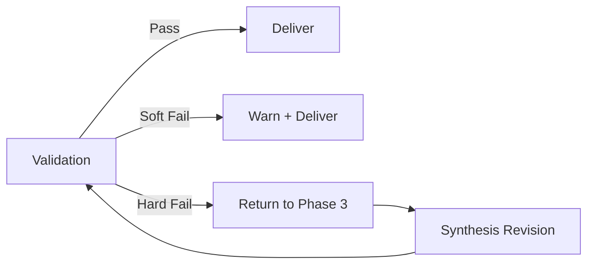

# Phase 4: Validate

Phase 4 performs final quality checks before delivering the research output.

## Command

```bash
/_research-validate
```

## Validation Checks

### Citation Utilization

Measures what percentage of the unified citation pool appears in the final synthesis.

```
Utilization = (Citations Used / Total in Pool) × 100
```

| Level | Percentage | Status |
|-------|------------|--------|
| Excellent | 80%+ | Pass |
| Good | 60-79% | Pass |
| Marginal | 40-59% | Warning |
| Poor | <40% | Fail |

Low utilization suggests the synthesis ignored valuable research. The system flags this for review.

### Structure Validation

Confirms the six-part academic structure:

- [ ] Part I: Executive Summary present
- [ ] Part II: Research Methodology present
- [ ] Part III: Research Findings by Perspective present
- [ ] Part IV: Integrated Analysis present
- [ ] Part V: Emergent Research Directions present
- [ ] Part VI: References and Appendices present

Missing parts trigger a validation failure.

### Citation Density Analysis

Measures inline citation frequency:

| Metric | Target | Measurement |
|--------|--------|-------------|
| Citations per paragraph | 3-5 | Count `[N]` per paragraph |
| Citation-free paragraphs | 0 | Flag paragraphs without `[N]` |
| Reference coverage | 100% | All `[N]` appear in Part VI |

### Track Representation

Verifies balanced perspective coverage:

| Track | Expected | Validation |
|-------|----------|------------|
| Standard | ~50% | Check Part III sections |
| Independent | ~25% | Academic sources cited |
| Contrarian | ~25% | Dissenting views included |

Missing tracks indicate synthesis bias.

### Metadata Verification

Confirms synthesis metadata accuracy:

- Perspective count matches session
- Agent attribution complete
- Date and session ID correct
- Quality metrics recorded

## Validation Report

The phase produces a validation report:

```markdown
# Validation Report

**Session:** YYYYMMDD-HHMMSS-XXXX
**Date:** 2025-12-26

## Citation Utilization
- Pool Size: 45 citations
- Citations Used: 32
- Utilization: 71% ✓

## Structure Validation
- Part I: ✓
- Part II: ✓
- Part III: ✓
- Part IV: ✓
- Part V: ✓
- Part VI: ✓

## Citation Density
- Total Paragraphs: 24
- Average Citations/Paragraph: 4.2
- Citation-Free Paragraphs: 0

## Track Representation
- Standard: 52% ✓
- Independent: 24% ✓
- Contrarian: 24% ✓

## Overall Status: PASS
```

## Failure Handling

### Soft Failures (Warnings)

Continue with flagged output:
- Utilization 40-59%
- Minor track imbalance
- 1-2 citation-free paragraphs

### Hard Failures (Block)

Return to Phase 3 for revision:
- Utilization <40%
- Missing structure parts
- No citations at all
- Severe track imbalance

### Recovery Flow



## Final Output

On successful validation, the research output includes:

1. **final-synthesis.md** - Complete research document
2. **validation-report.md** - Quality metrics
3. **Session metadata** - Reproducibility information

## Outputs

| File | Content |
|------|---------|
| `synthesis/final-synthesis.md` | Validated research output |
| `analysis/validation-report.md` | Quality check results |

## Quality Assurance

Phase 4 ensures:
- Research is well-sourced (citation utilization)
- Structure meets academic standards (six parts)
- Claims are supported (citation density)
- Perspectives are balanced (track representation)

---

Back to: [README](../README.md)
