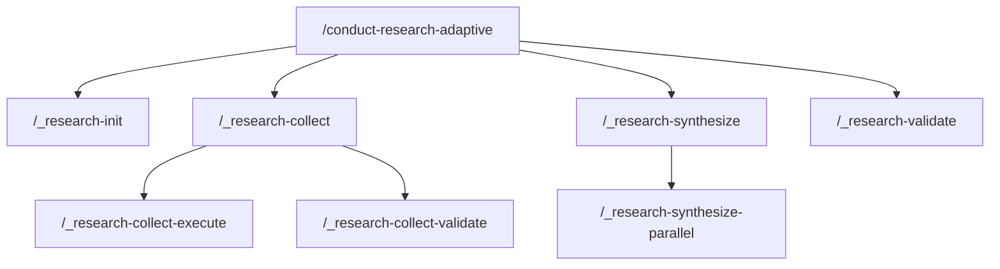

# Command Reference

All slash commands used in the research workflow.

## Main Entry Point

### /conduct-research-adaptive

Runs a complete adaptive research workflow.

```bash
/conduct-research-adaptive "Your research question here"
```

**What it does:**
1. Analyzes your query
2. Generates research perspectives
3. Launches Wave 1 agents
4. Decides if Wave 2 needed
5. Validates citations
6. Synthesizes findings
7. Validates output quality

**Returns:** Path to final synthesis file.

## Phase Commands

These are internal commands called by the orchestrator. You can run them directly for debugging.

### /_research-init

Initializes a research session.

```bash
/_research-init "$USER_QUERY"
```

**Outputs:**
- `analysis/query-analysis.json`
- `analysis/perspectives.json`
- Session directory structure

### /_research-collect

Orchestrates the collection phase.

```bash
/_research-collect
```

Calls execute and validate sub-phases.

### /_research-collect-execute

Launches agents and makes pivot decisions.

```bash
/_research-collect-execute
```

**Outputs:**
- `wave-1/*.md` - Agent research files
- `wave-2/*.md` - Specialist files (if pivot)
- `analysis/pivot-decision.json`

### /_research-collect-validate

Validates citations from agent outputs.

```bash
/_research-collect-validate
```

**Outputs:**
- `analysis/unified-citations.md`
- Citation validation metrics

### /_research-synthesize

Orchestrates the synthesis phase.

```bash
/_research-synthesize
```

Calls parallel synthesis and review loop.

### /_research-synthesize-parallel

Runs parallel summarization and synthesis.

```bash
/_research-synthesize-parallel
```

**Outputs:**
- `summaries/summary-*.md`
- `synthesis/final-synthesis.md`

### /_research-validate

Performs final quality validation.

```bash
/_research-validate
```

**Outputs:**
- `analysis/validation-report.md`
- Quality gate status

## Environment Variables

Commands use these environment variables:

| Variable | Description |
|----------|-------------|
| `SESSION_DIR` | Path to session directory |
| `SESSION_ID` | Unique session identifier |
| `USER_QUERY` | Original research query |
| `CURRENT_DATE` | Today's date |
| `PAI_DIR` | Path to PAI installation |
| `PERSPECTIVE_COUNT` | Number of perspectives |
| `WAVE1_COUNT` | Wave 1 agent count |

## Command Dependencies



## Command Locations

All commands live in the PAI commands directory:

```
~/.claude/commands/
├── conduct-research-adaptive.md
├── _research-init.md
├── _research-collect.md
├── _research-collect-execute.md
├── _research-collect-validate.md
├── _research-synthesize.md
├── _research-synthesize-parallel.md
└── _research-validate.md
```

Commands prefixed with `_` are internal helpers.

---

Back to: [README](../README.md)
