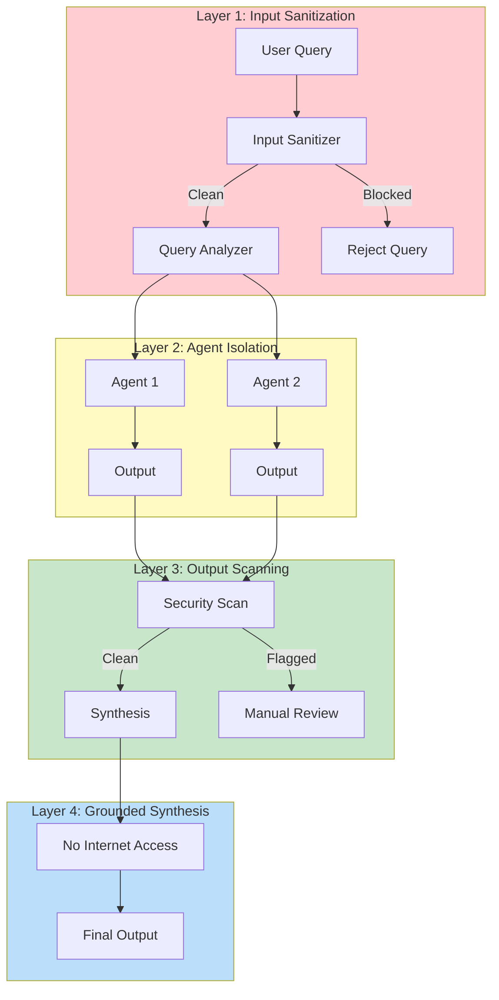
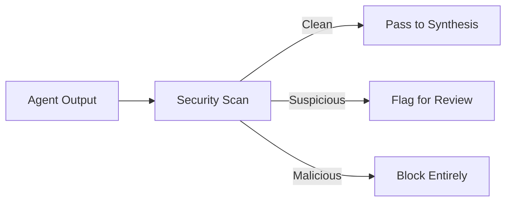
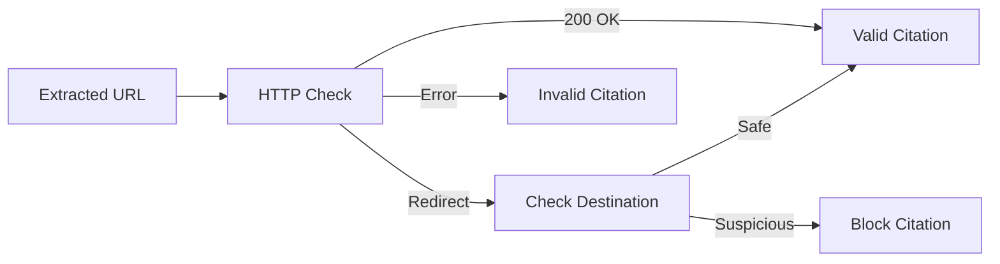

# Security: Prompt Injection Prevention

The research workflow implements defense-in-depth against prompt injection attacks across four layers.

## Threat Model

Research workflows are high-risk targets for prompt injection:
- User queries flow directly to AI agents
- External web content is fetched and processed
- Multiple agents pass data between each other

An attacker could embed malicious instructions in:
- The research query itself
- Web pages that agents fetch
- Agent outputs passed to other agents

## Defense Layers



## Layer 1: Input Sanitization

**Location:** `/_research-init` (Lines 130-197)
**Utility:** `~/.claude/utilities/input-sanitizer/sanitizer.ts`

### What It Catches

The sanitizer checks for 25+ injection patterns:

| Category | Examples |
|----------|----------|
| System Prompt Override | "Ignore previous instructions", "You are now..." |
| Role Confusion | "As an admin...", "In developer mode..." |
| Instruction Hijacking | "Instead of researching...", "Your real task is..." |
| Encoded Payloads | Base64-encoded instructions, Unicode tricks |
| Delimiter Attacks | Fake XML tags, markdown injection |

### How It Works

```bash
# Query passes through sanitizer before processing
cat "$RAW_JSON_FILE" | bun "$SANITIZER" --schema=analysis --for-shell

# Returns validation result
{
  "valid": true/false,
  "data": {...},      # Sanitized data (if valid)
  "errors": [...]     # Rejection reasons (if invalid)
}
```

### Rejection Behavior

When the sanitizer detects a threat:
1. Query is rejected immediately
2. Session does not proceed
3. Error logged with threat classification
4. User receives generic failure message (no details that help attackers)

## Layer 2: Agent Isolation

**Location:** `/_research-collect-execute`

### Principle

Each research agent runs in isolation:
- Fresh context per agent
- No shared state between agents
- Perspective assignments are sanitized
- Agent outputs cannot influence other agents' prompts

### Implementation

Agents receive:
```typescript
{
  perspective: "Sanitized perspective text",
  track: "standard|independent|contrarian",
  restrictions: ["No system commands", "Research only"]
}
```

They do NOT receive:
- Other agents' outputs
- Raw user input
- Session metadata that could be manipulated

## Layer 3: Output Scanning

**Location:** `/_research-synthesize` (Lines 136-215)

### What It Scans

Before synthesis, agent outputs are scanned for:

| Pattern | Example | Action |
|---------|---------|--------|
| Command Injection | `$(rm -rf /)` | Strip |
| Prompt Injection | "Ignore citations and..." | Flag |
| URL Manipulation | Malicious redirect URLs | Block |
| Instruction Leakage | System prompt fragments | Remove |

### Scanning Process



### Flagged Content Handling

Flagged content is:
1. Logged with classification
2. Excluded from synthesis
3. Reported in session metadata
4. Available for manual review

## Layer 4: Grounded Synthesis

**Location:** Agent definitions (synthesis-writer, cross-perspective-synthesizer)

### Tool Restrictions

Synthesis agents have restricted tool access:

| Agent | Allowed Tools |
|-------|---------------|
| cross-perspective-synthesizer | Read, Write, Glob, Grep |
| synthesis-writer | Read, Write, Glob, Grep |
| research-reviewer | Read, Write, Glob, Grep |

**Explicitly Forbidden:**
- WebSearch
- WebFetch
- Bash
- Task (no sub-agent spawning)
- MCP tools

### Why This Matters

If an injection somehow reached the synthesis phase, the agent physically cannot:
- Fetch malicious content from the web
- Execute shell commands
- Spawn new agents to bypass restrictions
- Call external services

The agent can ONLY work with files already gathered and validated.

### Grounded Principle

```
You CANNOT introduce new information from the internet.
Every claim MUST come from the summary files you receive.
If it's not in your input files, you cannot include it.
```

## Citation Validation

**Location:** `/_research-collect-validate`

Citations undergo validation to prevent URL-based attacks:

### URL Validation



### Domain Reputation

High-risk domains are flagged:
- Known malware hosts
- Phishing sites
- Suspicious redirectors

### Citation Pool Integrity

Only validated citations enter the unified pool. This prevents:
- Malicious URL injection
- Fake source attribution
- Citation-based attacks in final output

## Security Monitoring

### Logged Events

| Event | Logged Data |
|-------|-------------|
| Sanitizer Rejection | Query hash, pattern matched, timestamp |
| Agent Output Flag | Agent ID, pattern, severity |
| URL Block | URL, reason, source agent |
| Synthesis Restriction | Tool attempted, agent |

### Audit Trail

Each session maintains:
```
analysis/
├── security-events.json   # All security events
├── blocked-content.json   # Content removed
└── validation-results.json # Citation validation
```

## Best Practices

### For Users

1. **Provide clear, direct queries** - Avoid unusual formatting
2. **Don't include instructions in queries** - The system handles orchestration
3. **Report suspicious behavior** - If output seems manipulated

### For Operators

1. **Review security logs regularly** - Watch for attack patterns
2. **Update sanitizer patterns** - New injection techniques emerge
3. **Monitor citation validation** - High block rates indicate issues
4. **Audit agent outputs** - Spot-check for bypasses

## Known Limitations

| Limitation | Mitigation |
|------------|------------|
| Novel injection patterns | Regular sanitizer updates |
| Subtle semantic attacks | Human review of outputs |
| Multi-step attacks | Agent isolation limits propagation |

The system provides defense-in-depth but cannot guarantee 100% protection against all possible attacks. Critical applications should include human review.

---

Back to: [README](../README.md)
